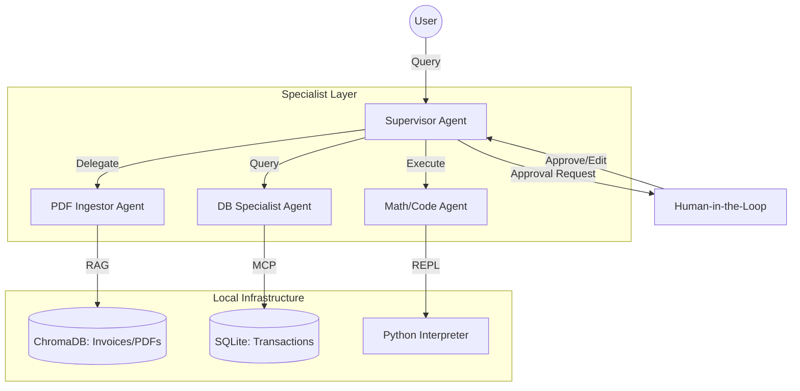

# Local Private Financial Analyst

This system moves away from simple chat and into autonomous financial operations. It can ingest your bank statements (PDFs), query your local transaction database (via MCP), and perform high-precision tax or investment calculations (via Python REPL).

## Architecture Diagram

We will follow a Hierarchical Supervisor Pattern to ensure strict boundaries between sensitive data (DB) and external logic (Calculations).



## Part 1: The "Multi-Source Knowledge Ingestor"

The first step is building the "Memory" of the system. This script ingests your financial documents (invoices, tax forms) into a ChromaDB vector store using nomic-embed-text.

### Why this Ingestor is "Financial Grade"

- Strictly Local: Your invoices and bank data never touch the cloud. The Ollama embeddings run on your hardware.
- Overlapping Chunks: We use a chunk_overlap of 100 tokens. This ensures that a line item split across two pages in a PDF isn't lost in translation.
- Persistence: The ChromaDB stores the mathematical vectors on disk, so you only need to run this script once per document.

### Code Example

```python
from chromadb import Chroma
```

## Main Files

- [streamlit_private_financial_analyst.py](/Users/easonwu/Dev/personal/ai-agent-study/realworld/local_private_financial_analyst/streamlit_private_financial_analyst.py:1): Streamlit app with approval checkpoints for sensitive tool calls.
- [financial_analyst_engine.py](/Users/easonwu/Dev/personal/ai-agent-study/realworld/local_private_financial_analyst/financial_analyst_engine.py:1): Shared analyst engine and calculation helper tool.
- [cli_private_financial_analyst.py](/Users/easonwu/Dev/personal/ai-agent-study/realworld/local_private_financial_analyst/cli_private_financial_analyst.py:1): CLI workflow with a single approval step.
- [cli_private_financial_analyst_retry_loop.py](/Users/easonwu/Dev/personal/ai-agent-study/realworld/local_private_financial_analyst/cli_private_financial_analyst_retry_loop.py:1): CLI workflow that keeps resuming until the task completes or access is denied.
- [finance_transactions_mcp_server.py](/Users/easonwu/Dev/personal/ai-agent-study/realworld/local_private_financial_analyst/finance_transactions_mcp_server.py:1): MCP server for transaction database access.
- [ingest_financial_documents.py](/Users/easonwu/Dev/personal/ai-agent-study/realworld/local_private_financial_analyst/ingest_financial_documents.py:1): PDF ingestion into the local vector store.
- [build_financial_vector_store.py](/Users/easonwu/Dev/personal/ai-agent-study/realworld/local_private_financial_analyst/build_financial_vector_store.py:1): alternate vector-store build script.
- [initialize_transactions_db.py](/Users/easonwu/Dev/personal/ai-agent-study/realworld/local_private_financial_analyst/initialize_transactions_db.py:1): initializes the demo SQLite transaction database.
- [generate_sample_finance_documents.py](/Users/easonwu/Dev/personal/ai-agent-study/realworld/local_private_financial_analyst/generate_sample_finance_documents.py:1): creates sample PDF inputs for local testing.
