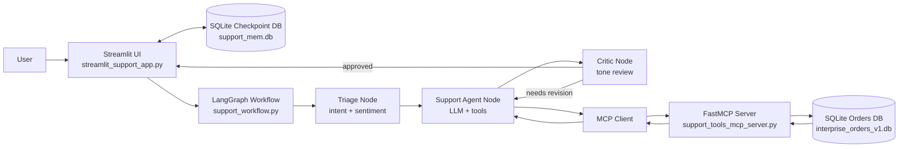
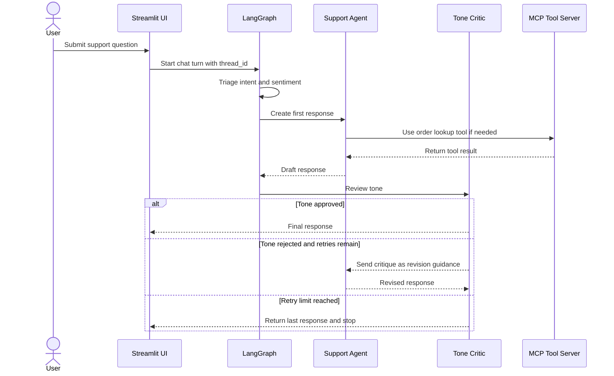

# Smart Helpdesk Agent v1

This example shows a customer-support workflow built with LangGraph, MCP, and Streamlit. The app accepts a user request, classifies the request and sentiment, lets an agent use support tools when needed, and runs a tone critic before returning the final answer.

The latest implementation adds safer retry behavior, file-relative paths, and clearer logs so the interaction flow is easy to follow while debugging.

## What Changed In The Current Version

- The agent no longer loops forever when the critic rejects a draft. Critic feedback is stored in graph state and fed into the next agent attempt.
- Retries are capped with `MAX_AGENT_REVISIONS` in [support_workflow.py](/Users/easonwu/Dev/personal/ai-agent-study/realworld/smart_helpdesk_agent/v1/support_workflow.py:13).
- The Streamlit app only captures a final `AIMessage` as the assistant response, which avoids showing intermediate tool or graph messages as the final answer.
- Local resources now use file-relative paths in [streamlit_support_app.py](/Users/easonwu/Dev/personal/ai-agent-study/realworld/smart_helpdesk_agent/v1/streamlit_support_app.py:20) and [support_tools_mcp_server.py](/Users/easonwu/Dev/personal/ai-agent-study/realworld/smart_helpdesk_agent/v1/support_tools_mcp_server.py:13), making the app more reliable when launched from different working directories.
- Logging now reflects the full sequence of a request across the Streamlit app, LangGraph workflow, and MCP tool server.

## Architecture

The app is split into three layers:

1. `streamlit_support_app.py`
   Runs the Streamlit chat UI, creates the MCP client, opens the LangGraph checkpoint store, and streams the workflow for each user turn.
2. `support_workflow.py`
   Defines the graph and the support state. The graph contains three stages:
   - `Triage`: classifies `intent` and `sentiment`
   - `Agent`: answers the user and calls tools when needed
   - `Critic`: reviews empathy and can request a revision
3. `support_tools_mcp_server.py`
   Exposes secure support tools over MCP. In this version, the main tool is `lookup_order_secure(order_id, customer_email)`.



## Request Lifecycle



## Logging Sequence

The logs are designed to read like a step-by-step trace for a single turn.

Typical flow:

```text
[Bootstrap] Creating shared support engine and MCP client.
[Turn <thread_id>] Received user prompt (...)
[Turn <thread_id>] Opening graph with checkpoint store ...
[Graph] Loaded support tools: ['lookup_order_secure']
[Graph] Support workflow compiled successfully.
[Turn <thread_id>] Starting graph stream.
[Graph] Step 1/3 - Triage started.
[Graph] Step 1/3 - Triage complete. intent=shipping sentiment=neutral
[Graph] Step 2/3 - Agent attempt 1 started...
[Tool] lookup_order_secure called for order_id=...
[Tool] lookup_order_secure success for order_id=...
[Graph] Step 2/3 - Agent attempt 1 complete. ...
[Graph] Step 3/3 - Critic review started.
[Graph] Step 3/3 - Critic complete. approved=True critique=<empty>
[Graph] Critic approved response. Finishing workflow.
[Turn <thread_id>] Final AI response captured.
```

This makes it much easier to tell whether a problem happened in the UI layer, the graph, or the tool server.

## Files

- [streamlit_support_app.py](/Users/easonwu/Dev/personal/ai-agent-study/realworld/smart_helpdesk_agent/v1/streamlit_support_app.py:1): Streamlit chat app and request orchestration.
- [support_workflow.py](/Users/easonwu/Dev/personal/ai-agent-study/realworld/smart_helpdesk_agent/v1/support_workflow.py:1): LangGraph workflow, retry loop, and tone critic logic.
- [support_tools_mcp_server.py](/Users/easonwu/Dev/personal/ai-agent-study/realworld/smart_helpdesk_agent/v1/support_tools_mcp_server.py:1): MCP server and secure order lookup tool.
- [initialize_support_database.py](/Users/easonwu/Dev/personal/ai-agent-study/realworld/smart_helpdesk_agent/v1/initialize_support_database.py:1): Creates and seeds the demo SQLite order database.

## Requirements

Install the Python dependencies needed by your environment:

- `streamlit`
- `langchain`
- `langgraph`
- `langchain-ollama`
- `langchain-mcp-adapters`
- `fastmcp`
- `nest_asyncio`
- `aiosqlite`

You also need an Ollama-compatible model endpoint available for:

- `kimi-k2.5:cloud`

If you want to use a different model, update the `ChatOllama(...)` configuration in [support_workflow.py](/Users/easonwu/Dev/personal/ai-agent-study/realworld/smart_helpdesk_agent/v1/support_workflow.py:43).

## Running Locally

Run the commands from the `realworld/smart_helpdesk_agent/v1` directory so the database initialization script writes the demo DB in the expected location.

```bash
cd realworld/smart_helpdesk_agent/v1
python initialize_support_database.py
streamlit run streamlit_support_app.py
```

Then open the Streamlit app in your browser and try prompts such as:

- `Where is order ORD-101? My email is eason@example.com`
- `I still haven't received my order and I'm getting frustrated`
- `Can you help me track ORD-999 for eason@example.com?`

## Notes

- The order lookup tool requires both the order ID and the matching customer email.
- The checkpoint DB `support_mem.db` stores graph thread state across turns.
- The seeded order database file is named `interprise_orders_v1.db`, matching the current code.
- If the critic still rejects the answer after the retry limit, the graph stops instead of retrying forever.
